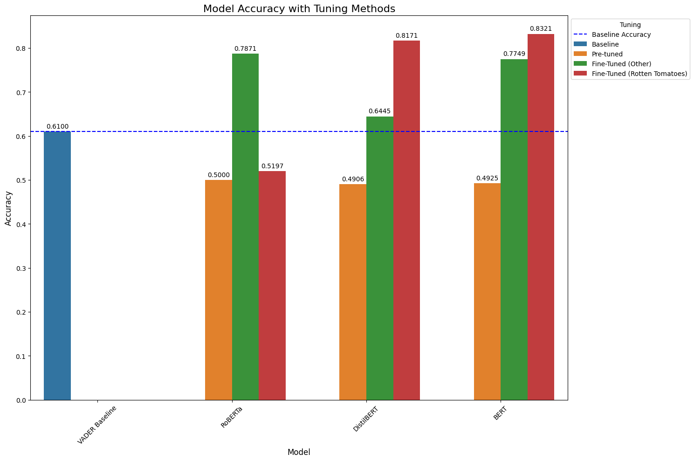
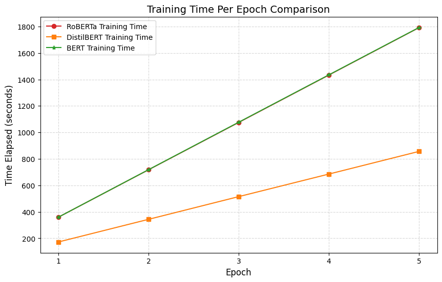
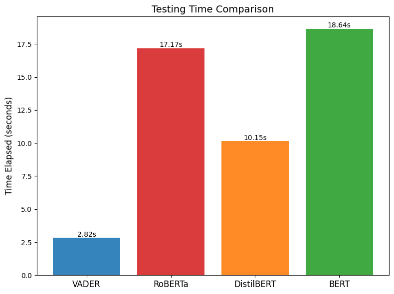

# Sentiment Analysis with Transformers on Rotten Tomatoes Reviews

## Project Overview

This project performs sentiment analysis on movie reviews from the **Rotten Tomatoes** dataset using pre-trained transformer models, including **RoBERTa**, **DistilBERT**, and **BERT**. The goal is to classify each review as either **positive** or **negative** and compare the performance of these models using various evaluation metrics.

All preprocessing, model evaluation, and results comparison are consolidated into a single notebook: `final-report.ipynb`.

### Key Findings:
- **Goal**: Find the best model that accurately predicts sentiment (positive/negative) of movie reviews
- **Data**: The [Rotten Tomatoes](https://huggingface.co/datasets/cornell-movie-review-data/rotten_tomatoes) dataset from HuggingFace.
- **Models Used**: **VADER**, **RoBERTa**, **DistilBERT**, **BERT**
- **Best Model**: Fine-tuned **BERT** model that was trained on the Rotten Tomatoes dataset:
    - Training set: 84.77%
    - Validation set: 85.08%
    - Testing set: 83.21%

### Model Comparison:

| Model       | Accuracy | Precision | Recall  | F1 Score | ROC-AUC Score |
|-------------|----------|-----------|---------|----------|---------------|
| RoBERTa     | 0.5197   | 0.5235    | 0.4390  | 0.4776   | 0.5197        |
| DistilBERT  | 0.8171   | 0.8536    | 0.7655  | 0.8071   | 0.8171        |
| BERT        | 0.8321   | 0.8417    | 0.8180  | 0.8297   | 0.8321        |

## Technology Stack 👾
- Programming Language: `Python`
- Framework: `PyTorch`
- Libraries:
    - Data Processing: `pandas`, `numpy`
    - Visualization: `matplotlib`, `seaborn`, `wordcloud`
    - Machine Learning: `datasets`, `transformers`, `scikit-learn`
    - Others: `nltk`, `tqdm`, `scipy`, `time`

## File Structure 📂

```plaintext
├── data/
│   ├── train.csv  # Training dataset
│   ├── test.csv   # Testing dataset
│   ├── val.csv    # Validation dataset
├── models/
│   ├── roberta_model.sav     # Fine-tuned RoBERTa model
│   ├── distilbert_model.sav  # Fine-tuned DistilBERT model
│   ├── bert_model.sav        # Fine-tuned BERT model
├── img/
│   ├── model_testing_accuracies.png  # Testing accuracies graph
│   ├── testing_times.png             # Testing times graph
│   ├── training_times.png            # Training times graph
├── requirements.txt     # Dependencies for the project
├── final-report.ipynb   # Main notebook containing the entire
```

## Setup 🚀

### Prerequisites
Ensure you have the following installed:
- Python 3.8+
- PyTorch
- Hugging Face Transformers
- Jupyter Notebook or Jupyter Lab
- Other dependencies listed in requirements.txt

Install dependencies using:

```plaintext
pip install -r requirements.txt
```

### Dataset
The dataset is divided into three parts:
- `train.csv`: For training the models.
- `val.csv`: For model validation.
- `test.csv`: For final evaluation.

## Project Workflow 📝
All steps are documented and executed in `final.ipynb`:

1. **Load Data and Exploratory Data Analysis (EDA)**:
    - Load the dataset into the environment.
    - Conduct EDA to visualize and analyze the distribution of positive and negative reviews, uncovering insights about the data.

2. **NLTK Baseline**:
    - Perform sentiment analysis using the VADER lexicon from the NLTK library.
    - Use the VADER results as a benchmark for comparison against transformer-based models.

3. **Pre-Tuned Model Evaluations**:
    - Evaluate the performance of pre-trained transformer models (**RoBERTa**, **DistilBERT**, **BERT**) without fine-tuning on the dataset.
    - Compare their outputs to pre-trained models tested on other datasets for broader insights.

4. **Data and Model Preparation**:
    - `Dataset Class`: Prepare a reusable class for efficient data management and preprocessing.
    - `DataLoaders`: Create DataLoaders for batch processing, ensuring efficient memory and computational resource usage.
    - `SentimentClassifier Class`: Build a custom class for sentiment analysis models with the following features:
        - Dropout for regularization.
        - A fully connected layer for consistent output across models.
    - `Training and Validation Functions`: Implement functions to train and validate models effectively.
    - `Plotting Function`: Create a utility to plot accuracy and loss for visual analysis of training progress.

5. **Training and Validation**:
    - Set hyperparameters for tuning, such as learning rate, batch size, and epochs.
    - Train and validate the models (**RoBERTa**, **DistilBERT**, **BERT**) on the dataset.
    - Generate and plot:
        - Training Metrics: Accuracy and loss over epochs.
        - Validation Metrics: Accuracy and loss over epochs.

6. **Testing**:
    - Test all trained models on the test set to evaluate real-world performance.

7. **Model Comparison**:
    - Assess the performance of each model based on the following metrics:
        -  Accuracy: Overall correctness of predictions.
        - Precision: Model's ability to correctly identify positive cases.
        - Recall: Model's ability to capture all actual positive cases.
        - F1-Score: Harmonic mean of precision and recall.
        - ROC-AUC: Model's ability to distinguish between positive and negative cases.
    - Compare pre-tuned and fine-tuned versions of all models to identify the best-performing approach.

## Findings 🔍

### Model Evaluations

| Model                                    | Accuracy | Precision | Recall  | F1 Score | ROC-AUC Score | Duration   |
|------------------------------------------|----------|-----------|---------|----------|---------------|------------|
| VADER                                    | 0.6100   | 0.5771    | 0.8230  | 0.6785   | 0.6100        | 2.823124   |
| Pre-tuned RoBERTa                        | 0.5000   | 0.0000    | 0.0000  | 0.0000   | 0.5000        | 12.419727  |
| Fine-tuned RoBERTa (Twitter)             | 0.7871   | 0.8148    | 0.7430  | 0.7772   | 0.7871        | 12.579784  |
| Fine-tuned RoBERTa (Rotten Tomatoes)     | 0.5197   | 0.5235    | 0.4390  | 0.4776   | 0.5197        | 12.419727  |
| Pre-tuned DistilBERT                     | 0.4906   | 0.4951    | 0.9568  | 0.6526   | 0.4906        | 8.350171   |
| Fine-tuned DistilBERT (multilingual sentiment) | 0.6445   | 0.6851    | 0.5347  | 0.6006   | 0.6445        | 8.634897   |
| Fine-tuned DistilBERT (Rotten Tomatoes)  | 0.8171   | 0.8536    | 0.7655  | 0.8071   | 0.8171        | 8.350171   |
| Pre-tuned BERT                           | 0.4925   | 0.3333    | 0.0150  | 0.0287   | 0.4925        | 11.937287  |
| Fine-tuned BERT (multilingual sentiment) | 0.7749   | 0.7504    | 0.8236  | 0.7853   | 0.7749        | 13.202971  |
| **Fine-tuned BERT (Rotten Tomatoes)**        | 0.8321   | 0.8417    | 0.8180  | 0.8297   | 0.8321        | 11.937287  |

**BERT Fine-Tuned**:
- Achieves the best performance across all metrics.
- Accuracy: 83.21% and F1-Score: 0.8297, showcasing its strong classification ability.
- ROC-AUC: 83.21%, indicating excellent discrimination between positive and negative classes.

**DistilBERT Fine-Tuned**:
- Performs slightly worse than BERT but still maintains high effectiveness.
- Accuracy: 81.71% and F1-Score: 0.8071, showing reliable predictions.

**RoBERTa Fine-Tuned**:
- Struggles compared to the other two models.
- Accuracy: 51.97% and F1-Score: 0.4776, indicating weak sentiment classification on this dataset.

### Training and Testing Times
<p align="center">
  
&nbsp; &nbsp; &nbsp; &nbsp;
  
</p>

**Training Times**:
- BERT and RoBERTa has almost exactly the same training times.
- DistilBERT is significantly faster during training.

**Testing Times**:
- BERT and RoBERTa demonstrated similar testing times, with BERT taking slightly longer.
- DistilBERT is significantly faster than the other two models being almost twice as fast as BERT during testing.
- All 3 transformers are take significantly faster to test than VADER.

### General Observations

1. **Importance of Fine-Tuning**:
    - Fine-tuning on the Rotten Tomatoes dataset significantly enhances all models' performance, making them more domain-specific and effective for sentiment analysis.

2. **BERT's Dominance**:
    - BERT outperforms all other models in both fine-tuned and pre-tuned settings, indicating its robustness and versatility.

3. **DistilBERT as a Compact Alternative**:
    - While DistilBERT lags slightly behind BERT, it serves as a strong lightweight alternative with respectable performance, especially when fine-tuned.
    - DistilBERT's faster training and testing times can also be more attractive to users compared to BERT's longer processes.

4. **RoBERTa's Struggles**:
    - RoBERTa struggles, likely due to a misalignment between its training data and the Rotten Tomatoes dataset.

### Summary
- Fine-tuning is essential for adapting models to specific datasets like Rotten Tomatoes.
- BERT fine-tuned is the best-performing model, while DistilBERT offers a good balance between performance and efficiency.

## Contributions 📝
**Anaqi Amir**
- LinkedIn: [@anaqi-amir](https://www.linkedin.com/in/anaqi-amir/)
- GitHub: [@AnaqiAmir](https://github.com/AnaqiAmir)
- Kaggle: [@anaqiamir](https://www.kaggle.com/anaqiamir/code)
