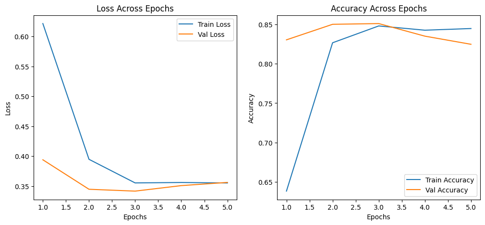

# Sentiment Analysis with Transformers on Rotten Tomatoes Reviews

## Project Overview

This project performs sentiment analysis on movie reviews from the **Rotten Tomatoes** dataset using pre-trained transformer models, including **RoBERTa**, **DistilBERT**, and **BERT**. The goal is to classify each review as either **positive** or **negative** and compare the performance of these models using various evaluation metrics.

All preprocessing, model evaluation, and results comparison are consolidated into a single notebook: `final.ipynb`.

### **Key Findings**:
- **Goal**: Find the best model that accurately predicts sentiment (positive/negative) of movie reviews
- **Data**: The [Rotten Tomatoes](https://huggingface.co/datasets/cornell-movie-review-data/rotten_tomatoes) dataset from HuggingFace.
- **Models Used**: **VADER**, **RoBERTa**, **DistilBERT**, **BERT**
- **Best Model**: Fine-tuned **BERT** model that was trained on the Rotten Tomaotes dataset:
    - Training set: 84.45%
    - Validation set: 82.46%
    - Testing set: 83.21%

### **Model Comparison**:

| Model       | Accuracy | Precision | Recall  | F1 Score | ROC-AUC Score |
|-------------|----------|-----------|---------|----------|---------------|
| RoBERTa     | 0.5131   | 0.5233    | 0.2946  | 0.3770   | 0.5131        |
| DistilBERT  | 0.7983   | 0.7880    | 0.8161  | 0.8018   | 0.7983        |
| BERT        | 0.8321   | 0.8417    | 0.8180  | 0.8297   | 0.8321        |

## Technology Stack 👾
- Programming Language: `Python`
- Framework: `PyTorch`
- Libraries:
    - Data Processing: `pandas`, `numpy`, `wordcloud`
    - Visualization: `matplotlib`, `seaborn`
    - Machine Learning: `datasets`, `transformers`, `scikit-learn`
    - Others: `nltk`, `tqdm`, `scipy`

## File Structure 📂

```plaintext
├── data/
│   ├── train.csv  # Training dataset
│   ├── test.csv   # Testing dataset
│   ├── val.csv    # Validation dataset
├── models/
│   ├── roberta_model.pt  # Fine-tuned RoBERTa model
│   ├── distilbert_model.pt  # Fine-tuned DistilBERT model
│   ├── bert_model.pt  # Fine-tuned BERT model
├── requirements.txt   # Dependencies for the project
├── final.ipynb   # Main notebook containing the entire
```

## Setup 🚀

### Prerequisites
Ensure you have the following installed:
- Python 3.8+
- PyTorch
- Hugging Face Transformers
- Jupyter Notebook or Jupyter Lab
- Other dependencies listed in requirements.txt

Install dependencies using:

```plaintext
pip install -r requirements.txt
```

### Dataset
The dataset is divided into three parts:
- `train.csv`: For training the models.
- `val.csv`: For model validation.
- `test.csv`: For final evaluation.

## Project Workflow 📝
All steps are documented and executed in `final.ipynb`:

### 1. Load Data and Exploratory Data Analysis (EDA):
- Load the dataset into the environment.
- Conduct EDA to visualize and analyze the distribution of positive and negative reviews, uncovering insights about the data.

### 2. NLTK Baseline:
- Perform sentiment analysis using the VADER lexicon from the NLTK library.
- Use the VADER results as a benchmark for comparison against transformer-based models.

### 3. Pre-Tuned Model Evaluations:
- Evaluate the performance of pre-trained transformer models (**RoBERTa**, **DistilBERT**, **BERT**) without fine-tuning on the dataset.
- Compare their outputs to pre-trained models tested on other datasets for broader insights.

### 4. Data and Model Preparation:
- `Dataset Class`: Prepare a reusable class for efficient data management and preprocessing.
- `DataLoaders`: Create DataLoaders for batch processing, ensuring efficient memory and computational resource usage.
- `SentimentClassifier Class`: Build a custom class for sentiment analysis models with the following features:
    - Dropout for regularization.
    - A fully connected layer for consistent output across models.
- `Training and Validation Functions`: Implement functions to train and validate models effectively.
- `Plotting Function`: Create a utility to plot accuracy and loss for visual analysis of training progress.

### 5. Training and Validation:
- Set hyperparameters for tuning, such as learning rate, batch size, and epochs.
- Train and validate the models (**RoBERTa**, **DistilBERT**, **BERT**) on the dataset.
- Generate and plot:
    - Training Metrics: Accuracy and loss over epochs.
    - Validation Metrics: Accuracy and loss over epochs.

### 6. Testing:
- Test all trained models on the test set to evaluate real-world performance.

### 7. Model Comparison:
- Assess the performance of each model based on the following metrics:
    -  Accuracy: Overall correctness of predictions.
    - Precision: Model's ability to correctly identify positive cases.
    - Recall: Model's ability to capture all actual positive cases.
    - F1-Score: Harmonic mean of precision and recall.
    - ROC-AUC: Model's ability to distinguish between positive and negative cases.
- Compare pre-tuned and fine-tuned versions of all models to identify the best-performing approach.

## Findings 🔍

### **Accuracy and Loss over Epochs for BERT**


### Table for Full Model Comparison
| Model                                         | Accuracy | Precision | Recall | F1 Score | ROC-AUC Score |
|-----------------------------------------------|----------|-----------|--------|----------|---------------|
| Pre-tuned RoBERTa                             | 0.4944   | 0.4970    | 0.9306 | 0.6479   | 0.4944        |
| Fine-tuned RoBERTa (Twitter)                  | 0.7871   | 0.8148    | 0.7430 | 0.7772   | 0.7871        |
| Fine-tuned RoBERTa (Rotten Tomatoes)          | 0.5131   | 0.5233    | 0.2946 | 0.3770   | 0.5131        |
| Pre-tuned DistilBERT                          | 0.4653   | 0.4757    | 0.6792 | 0.5595   | 0.4653        |
| Fine-tuned DistilBERT (multilingual sentiment)| 0.6445   | 0.6851    | 0.5347 | 0.6006   | 0.6445        |
| Fine-tuned DistilBERT (Rotten Tomatoes)       | 0.7983   | 0.7880    | 0.8161 | 0.8018   | 0.7983        |
| Pre-tuned BERT                                | 0.4765   | 0.4194    | 0.1220 | 0.1890   | 0.4765        |
| Fine-tuned BERT (multilingual sentiment)      | 0.7749   | 0.7504    | 0.8236 | 0.7853   | 0.7749        |
| **Fine-tuned BERT (Rotten Tomatoes)**         | 0.8321   | 0.8417    | 0.8180 | 0.8297   | 0.8321        |

### Comparison of Fine-Tuned Models:

1. #### BERT Fine-Tuned:

- Achieves the best performance across all metrics.
- Accuracy: 83.21% and F1-Score: 82.97%, showcasing its strong classification ability.
- ROC-AUC: 83.21%, indicating excellent discrimination between positive and negative classes.

2. #### DistilBERT Fine-Tuned:

- Performs slightly worse than BERT but still maintains high effectiveness.
- Accuracy: 79.83% and F1-Score: 80.18%, showing reliable predictions.

3. #### RoBERTa Fine-Tuned:

- Struggles compared to the other two models.
- Accuracy: 51.31% and F1-Score: 37.70%, indicating weak sentiment classification on this dataset.

### Comparison of Pre-Tuned Models:

1. #### Sentiment Analysis Based Fine-Tuned Models vs Pre-Tuned Versions:

- Fine-tuning on a task (sentiment analysis) dramatically improves performance across all models, especially **RoBERTa** and **BERT**, which see significant increases in accuracy and F1-Score.
- For example, RoBERTa's accuracy jumps from 49.44% (pre-tuned) to 78.71% (fine-tuned).

2. #### Pre-Tuned BERT:

- Shows poor performance compared to its fine-tuned counterpart.
- Accuracy: 47.65% and F1-Score: 18.90%, highlighting the need for fine-tuning.

3. #### DistilBERT Pre-Tuned:

- Pre-tuned DistilBERT performs better than pre-tuned BERT but falls short compared to fine-tuned models.
- Accuracy: 46.53%, indicating that it requires fine-tuning to achieve optimal performance.

### General Observations:

1. #### Importance of Fine-Tuning:

- Fine-tuning on the Rotten Tomatoes dataset significantly enhances all models' performance, making them more domain-specific and effective for sentiment analysis.

2. #### BERT's Dominance:

- BERT outperforms all other models in both fine-tuned and pre-tuned settings, indicating its robustness and versatility.

3. #### DistilBERT as a Compact Alternative:

- While DistilBERT lags slightly behind BERT, it serves as a strong lightweight alternative with respectable performance, especially when fine-tuned.

4. #### RoBERTa's Struggles in Pre-Tuned Setting:

- RoBERTa struggles without fine-tuning, likely due to a misalignment between its training data and the Rotten Tomatoes dataset. Fine-tuning helps close this gap significantly.

### Summary
- Fine-tuning is essential for adapting models to specific datasets like Rotten Tomatoes.
- BERT fine-tuned is the best-performing model, while DistilBERT offers a good balance between performance and efficiency.
- Pre-tuned models alone are insufficient for achieving high accuracy in sentiment analysis on domain-specific data.

## Limitations 💣
### 1. **Data Size & Diversity**
- The Rotten Tomatoes dataset, while valuable, is relatively small compared to other large-scale sentiment datasets. This could limit the models' ability to generalize to other contexts or domains.
- The dataset is biased toward movie reviews, so the trained models may not perform well on text from different domains (e.g., product reviews, social media comments).

### 2. **Model Complexity vs. Efficiency**
- Fine-tuned BERT achieves the best performance, but its computational complexity and training time are significantly higher compared to DistilBERT. This trade-off may be a concern for real-world applications requiring lightweight models.

### 3. **Limited Evaluation Metrics**
- While metrics like accuracy, precision, recall, F1-score, and ROC-AUC are valuable, they do not fully capture nuances in predictions, such as model confidence or specific error patterns.
- Further analysis of false positives and false negatives could provide deeper insights into model limitations.

### 4. **Sentiment Labels are Binary**
- The project assumes binary sentiment classification (positive vs. negative), which oversimplifies the spectrum of emotions. Texts with mixed or neutral sentiments are not well-represented.

### 5. **Dependency on Pre-Trained Architectures**
- The project relies heavily on pre-trained transformer-based models. While effective, these models are computationally expensive and may not be accessible for all users or projects.

### 6. **Single File Workflow**
- Using a single `final.ipynb` file for all steps (data processing, modeling, and evaluation) may make it harder to modularize and maintain the project as it grows. Separating scripts (e.g., data preprocessing, model training, evaluation) could enhance flexibility and readability.

### 7. **Overfitting Risks During Fine-Tuning**
- Fine-tuning on the Rotten Tomatoes dataset could lead to overfitting due to the limited size and domain specificity of the dataset. This might reduce generalizability to other datasets.

### 8. **No Hyperparameter Optimization**
- The project does not include rigorous hyperparameter tuning for the models. Exploring optimal parameters for learning rate, batch size, dropout, etc., could further improve performance.

### 9. **No Ensemble Approach**
- The project evaluates individual models but does not explore ensemble methods, which could combine the strengths of different architectures for potentially better performance.

### 10. **Hardware Limitations**
- Training large models like BERT or RoBERTa requires significant computational resources, which may not be feasible for researchers with limited access to GPUs or cloud resources.

## Recommendations and Future Work 🔬
Here are further steps that could be implemented to improve the project:

### 1. **Analyze Error Patterns**
- Perform a detailed error analysis to understand why models make incorrect predictions, particularly for false positives and false negatives.
- Identify specific text patterns or phrases that lead to misclassifications.

### 2. **Incorporate Data Augmentation**
- Use text augmentation techniques (e.g., synonym replacement, back-translation, or random word insertion) to artificially increase the size of the training dataset and improve generalization.

### 3. **Leverage Semi-Supervised Learning**
- Utilize semi-supervised approaches by incorporating a large amount of unlabeled text data to improve the models’ understanding of sentiment patterns.

### 4. **Fine-Tune Pre-Trained Models with Domain-Specific Data**
- Continue pre-training the models on a larger corpus of movie reviews or similar data before fine-tuning on the Rotten Tomatoes dataset. This domain-specific pre-training could improve performance.

### 5. **Implement Knowledge Distillation**
- Use knowledge distillation to combine the performance of larger models like BERT with the efficiency of smaller models like DistilBERT, achieving a better trade-off between accuracy and speed.

### 6. **Expand Evaluation Metrics**
- Evaluate models using additional metrics such as confusion matrices, Matthews correlation coefficient (MCC), or Cohen's Kappa for more comprehensive performance insights.
- Measure computational costs (e.g., inference time, memory usage) to assess the feasibility of deploying models in real-world scenarios.

### 7. **Explore Multi-Domain Transfer Learning**
- Fine-tune the models on datasets from multiple domains (e.g., product reviews, news articles, social media) to increase robustness across different contexts.

### 8. **Incorporate Explainable AI Techniques**
- Use methods like SHAP (SHapley Additive exPlanations) or LIME (Local Interpretable Model-agnostic Explanations) to make the model predictions interpretable and understandable to non-technical users.

### 9. **Add Neutral Sentiment Analysis**
- Expand the sentiment classification task from binary (positive vs. negative) to ternary (positive, neutral, negative) to capture a broader spectrum of emotions.

### 10. **Ensemble Learning**
- Combine predictions from multiple models using techniques like majority voting, weighted averaging, or stacking to improve overall performance.

### 11. **Optimize Workflow and File Structure**
- Split the project into modular files for better maintainability (e.g., separate scripts for preprocessing, modeling, evaluation, and visualization).
- Transition from a notebook-based workflow to a script-based workflow for scalability.

### 12. **Deploy the Model**
- Build a user-friendly web interface using frameworks like Flask, Django, or FastAPI to make the sentiment analysis tool accessible to non-technical users.
- Host the model on a cloud platform (e.g., AWS, GCP, Azure) for scalability and easy integration into other systems.

### 13. **Compare Models Across Domains**
- Test the fine-tuned models on datasets from other domains (e.g., social media, product reviews) to assess transferability.

### 14. **Investigate Few-Shot and Zero-Shot Learning**
- Experiment with advanced techniques like GPT or T5 for few-shot or zero-shot sentiment classification to reduce dependency on large labeled datasets.

### 15. **Incorporate Human-in-the-Loop**
- Implement a human-in-the-loop pipeline where human reviewers validate and refine model predictions, creating a feedback loop for continuous improvement.

These additional recommendations aim to address the identified limitations and further enhance the project's robustness, efficiency, and real-world applicability.

## Contributions 📝
**Anaqi Amir**
- LinkedIn: [@anaqi-amir](https://www.linkedin.com/in/anaqi-amir/)
- GitHub: [@AnaqiAmir](https://github.com/AnaqiAmir)
- Kaggle: [@anaqiamir](https://www.kaggle.com/anaqiamir/code)
