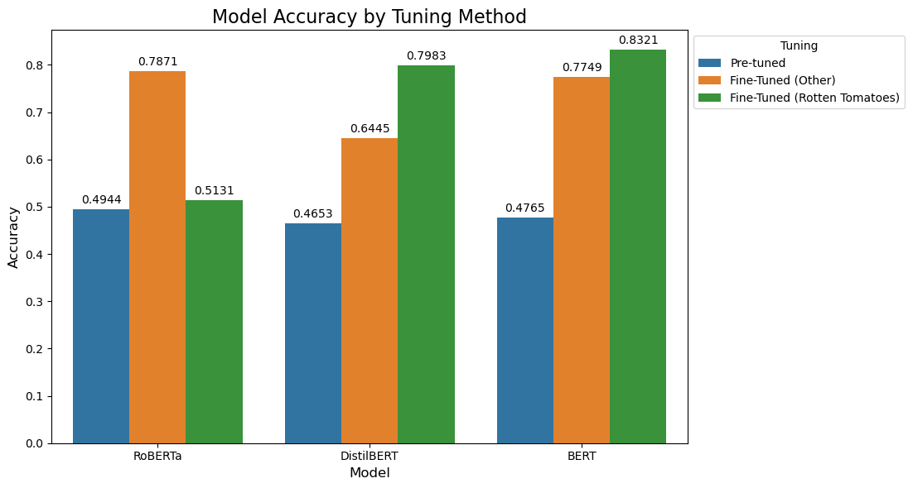

# Sentiment Analysis with Transformers on Rotten Tomatoes Reviews

## Project Overview

This project performs sentiment analysis on movie reviews from the **Rotten Tomatoes** dataset using pre-trained transformer models, including **RoBERTa**, **DistilBERT**, and **BERT**. The goal is to classify each review as either **positive** or **negative** and compare the performance of these models using various evaluation metrics.

All preprocessing, model evaluation, and results comparison are consolidated into a single notebook: `final.ipynb`.

### **Key Findings**:
- **Goal**: Find the best model that accurately predicts sentiment (positive/negative) of movie reviews
- **Data**: The [Rotten Tomatoes](https://huggingface.co/datasets/cornell-movie-review-data/rotten_tomatoes) dataset from HuggingFace.
- **Models Used**: **VADER**, **RoBERTa**, **DistilBERT**, **BERT**
- **Best Model**: Fine-tuned **BERT** model that was trained on the Rotten Tomaotes dataset:
    - Training set: 84.45%
    - Validation set: 82.46%
    - Testing set: 83.21%

### **Model Comparison**:

| Model       | Accuracy | Precision | Recall  | F1 Score | ROC-AUC Score |
|-------------|----------|-----------|---------|----------|---------------|
| RoBERTa     | 0.5131   | 0.5233    | 0.2946  | 0.3770   | 0.5131        |
| DistilBERT  | 0.7983   | 0.7880    | 0.8161  | 0.8018   | 0.7983        |
| BERT        | 0.8321   | 0.8417    | 0.8180  | 0.8297   | 0.8321        |

## Technology Stack 👾
- Programming Language: `Python`
- Framework: `PyTorch`
- Libraries:
    - Data Processing: `pandas`, `numpy`, `wordcloud`
    - Visualization: `matplotlib`, `seaborn`
    - Machine Learning: `datasets`, `transformers`, `scikit-learn`
    - Others: `nltk`, `tqdm`, `scipy`

## File Structure 📂

```plaintext
├── data/
│   ├── train.csv  # Training dataset
│   ├── test.csv   # Testing dataset
│   ├── val.csv    # Validation dataset
├── models/
│   ├── roberta_model.pt  # Fine-tuned RoBERTa model
│   ├── distilbert_model.pt  # Fine-tuned DistilBERT model
│   ├── bert_model.pt  # Fine-tuned BERT model
├── requirements.txt   # Dependencies for the project
├── final.ipynb   # Main notebook containing the entire
```

## Setup 🚀

### Prerequisites
Ensure you have the following installed:
- Python 3.8+
- PyTorch
- Hugging Face Transformers
- Jupyter Notebook or Jupyter Lab
- Other dependencies listed in requirements.txt

Install dependencies using:

```plaintext
pip install -r requirements.txt
```

### Dataset
The dataset is divided into three parts:
- `train.csv`: For training the models.
- `val.csv`: For model validation.
- `test.csv`: For final evaluation.

## Project Workflow 📝
All steps are documented and executed in `final.ipynb`:

1. **Load Data and Exploratory Data Analysis (EDA)**:
    - Load the dataset into the environment.
    - Conduct EDA to visualize and analyze the distribution of positive and negative reviews, uncovering insights about the data.

2. **NLTK Baseline**:
    - Perform sentiment analysis using the VADER lexicon from the NLTK library.
    - Use the VADER results as a benchmark for comparison against transformer-based models.

3. **Pre-Tuned Model Evaluations**:
    - Evaluate the performance of pre-trained transformer models (**RoBERTa**, **DistilBERT**, **BERT**) without fine-tuning on the dataset.
    - Compare their outputs to pre-trained models tested on other datasets for broader insights.

4. **Data and Model Preparation**:
    - `Dataset Class`: Prepare a reusable class for efficient data management and preprocessing.
    - `DataLoaders`: Create DataLoaders for batch processing, ensuring efficient memory and computational resource usage.
    - `SentimentClassifier Class`: Build a custom class for sentiment analysis models with the following features:
        - Dropout for regularization.
        - A fully connected layer for consistent output across models.
    - `Training and Validation Functions`: Implement functions to train and validate models effectively.
    - `Plotting Function`: Create a utility to plot accuracy and loss for visual analysis of training progress.

5. **Training and Validation**:
    - Set hyperparameters for tuning, such as learning rate, batch size, and epochs.
    - Train and validate the models (**RoBERTa**, **DistilBERT**, **BERT**) on the dataset.
    - Generate and plot:
        - Training Metrics: Accuracy and loss over epochs.
        - Validation Metrics: Accuracy and loss over epochs.

6. **Testing**:
    - Test all trained models on the test set to evaluate real-world performance.

7. **Model Comparison**:
    - Assess the performance of each model based on the following metrics:
        -  Accuracy: Overall correctness of predictions.
        - Precision: Model's ability to correctly identify positive cases.
        - Recall: Model's ability to capture all actual positive cases.
        - F1-Score: Harmonic mean of precision and recall.
        - ROC-AUC: Model's ability to distinguish between positive and negative cases.
    - Compare pre-tuned and fine-tuned versions of all models to identify the best-performing approach.

## Findings 🔍

### Model Comparison


### Table for Full Model Comparison
| Model                                         | Accuracy | Precision | Recall | F1 Score | ROC-AUC Score |
|-----------------------------------------------|----------|-----------|--------|----------|---------------|
| Pre-tuned RoBERTa                             | 0.4944   | 0.4970    | 0.9306 | 0.6479   | 0.4944        |
| Fine-tuned RoBERTa (Twitter)                  | 0.7871   | 0.8148    | 0.7430 | 0.7772   | 0.7871        |
| Fine-tuned RoBERTa (Rotten Tomatoes)          | 0.5131   | 0.5233    | 0.2946 | 0.3770   | 0.5131        |
| Pre-tuned DistilBERT                          | 0.4653   | 0.4757    | 0.6792 | 0.5595   | 0.4653        |
| Fine-tuned DistilBERT (multilingual sentiment)| 0.6445   | 0.6851    | 0.5347 | 0.6006   | 0.6445        |
| Fine-tuned DistilBERT (Rotten Tomatoes)       | 0.7983   | 0.7880    | 0.8161 | 0.8018   | 0.7983        |
| Pre-tuned BERT                                | 0.4765   | 0.4194    | 0.1220 | 0.1890   | 0.4765        |
| Fine-tuned BERT (multilingual sentiment)      | 0.7749   | 0.7504    | 0.8236 | 0.7853   | 0.7749        |
| **Fine-tuned BERT (Rotten Tomatoes)**         | 0.8321   | 0.8417    | 0.8180 | 0.8297   | 0.8321        |

### Comparison of Fine-Tuned Models:

1. **BERT Fine-Tuned**:
    - Achieves the best performance across all metrics.
    - Accuracy: 83.21% and F1-Score: 82.97%, showcasing its strong classification ability.
    - ROC-AUC: 83.21%, indicating excellent discrimination between positive and negative classes.

2. **DistilBERT Fine-Tuned**:
    - Performs slightly worse than BERT but still maintains high effectiveness.
    - Accuracy: 79.83% and F1-Score: 80.18%, showing reliable predictions.

3. **RoBERTa Fine-Tuned**:
    - Struggles compared to the other two models.
    - Accuracy: 51.31% and F1-Score: 37.70%, indicating weak sentiment classification on this dataset.

### Comparison of Pre-Tuned Models:

1. **Sentiment Analysis Based Fine-Tuned Models vs Pre-Tuned Versions**:
    - Fine-tuning on a task (sentiment analysis) dramatically improves performance across all models, especially **RoBERTa** and **BERT**, which see significant increases in accuracy and F1-Score.
    - For example, RoBERTa's accuracy jumps from 49.44% (pre-tuned) to 78.71% (fine-tuned).

2. **Pre-Tuned BERT**:
    - Shows poor performance compared to its fine-tuned counterpart.
    - Accuracy: 47.65% and F1-Score: 18.90%, highlighting the need for fine-tuning.

3. **DistilBERT Pre-Tuned**:
    - Pre-tuned DistilBERT performs better than pre-tuned BERT but falls short compared to fine-tuned models.
    - Accuracy: 46.53%, indicating that it requires fine-tuning to achieve optimal performance.

### General Observations:

1. **Importance of Fine-Tuning**:
    - Fine-tuning on the Rotten Tomatoes dataset significantly enhances all models' performance, making them more domain-specific and effective for sentiment analysis.

2. **BERT's Dominance**:
    - BERT outperforms all other models in both fine-tuned and pre-tuned settings, indicating its robustness and versatility.

3. **DistilBERT as a Compact Alternative**:
    - While DistilBERT lags slightly behind BERT, it serves as a strong lightweight alternative with respectable performance, especially when fine-tuned.

4. **RoBERTa's Struggles in Pre-Tuned Setting**:
    - RoBERTa struggles without fine-tuning, likely due to a misalignment between its training data and the Rotten Tomatoes dataset. Fine-tuning helps close this gap significantly.

### Summary
- Fine-tuning is essential for adapting models to specific datasets like Rotten Tomatoes.
- BERT fine-tuned is the best-performing model, while DistilBERT offers a good balance between performance and efficiency.
- Pre-tuned models alone are insufficient for achieving high accuracy in sentiment analysis on domain-specific data.

## Contributions 📝
**Anaqi Amir**
- LinkedIn: [@anaqi-amir](https://www.linkedin.com/in/anaqi-amir/)
- GitHub: [@AnaqiAmir](https://github.com/AnaqiAmir)
- Kaggle: [@anaqiamir](https://www.kaggle.com/anaqiamir/code)
